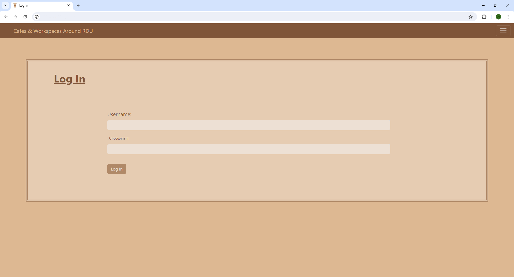

# Assignment 7: Cafe & Wifi Website

The portfolio project for day 88 of [100 Days of Code: The Complete Python Pro Bootcamp](https://www.udemy.com/course/100-days-of-code). The goal was to create a website of various cafes and tea houses in the Raleigh-Durham Triangle area in Raleigh, NC for remote working.

I used Flask, Bootstrap, HTML, CSS, and Python to create the functionality and aesthetics of the website. I used CS50's SQL classes and functions because I wanted to get more familiar with the syntax for SQL versus using SQLAcademy for this project.

### Index Page

The index page uses card groups from Bootstrap to display various tables and icons. Each card represents a cafe/workspace. Icons are SVGs from [SVG Repo](https://www.svgrepo.com) and are used to indicate the price of coffee/tea, seating and toilet availability, wifi strength, socket availability, and whether or not calls can be taken without disruption (i.e. the cafe being a frequently loud environment). There is a description panel, a button that redirects to Google Maps or other navigation to the cafe, and a disabled button indicating what kind of chain the cafe is (if applicable).

If a user is logged in, they can see an edit button to edit the cafe's information. If the admin (user_id #1) is logged in, they can see a delete button that deletes the workspace from the database.

I chose to use Bootstrap's Offcanvas Navigation bar for this project because I liked its look and functionality. If the user is not logged in, they see "Log In" and "Register". If they are logged in already, they see a "Log Out" option that clears the session variables and logs them out.

### Register Page

Users who don't have an account already may register to edit the cafes.

### Log In Page

Users who have an account already may log in to their accounts via the "Log In" route.

## How to add a Cafe

There is a plus sign SVG that redirects you to the "Add a Cafe" page. The position of this SVG changes depending on how many cards are in the row (i.e. if there are 3 cards in the row, its position moves down). A new cafe can also be added via the Offcanvas menu.

### Add Cafe Page

The add page uses Bootstrap forms to ensure the user enters all information before proceeding to allow them to add a cafe to the database.

### Edit Page

The edit page uses Bootstrap forms again, similar to the add page. Input areas are auto-populated with the cafe's existing information by SELECTing from the database and passing the values through to the Jinja template. The user can easily update the information while also seeing what information is already there!

### Delete a Cafe

Only the administrator (user_id #1) can delete a cafe from the database. The API is passed to the Jinja template.

## Credits

Created with the help of referencing days 66 and 69 of [100 Days of Code: The Complete Python Pro Bootcamp](https://www.udemy.com/course/100-days-of-code).

SVGs credited to [SVG Repo](https://www.svgrepo.com).

The palette is credited to [Coolors](https://coolors.co/palette/ede0d4-e6ccb2-ddb892-b08968-7f5539-9c6644).
