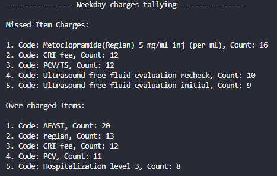
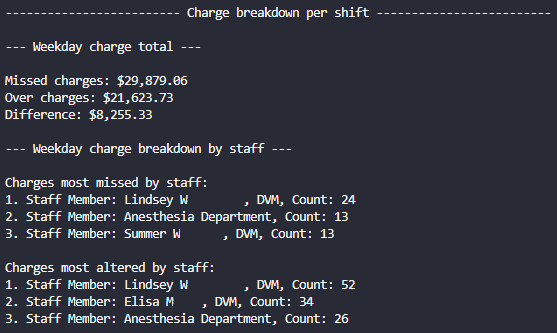

# Assignment 17: Custom Automation

The portfolio project for day 98 of [100 Days of Code: The Complete Python Pro Bootcamp](https://www.udemy.com/course/100-days-of-code). The goal was to automate some aspect of our lives using Python.

I decided to build a text-based program that helps build a report containing the top missed and overcharges found during the daily audits of hospitalized patients at the veterinary hospital where I work.

## Shift Breakdown Tally

There are 3 shifts to be analyzed: the weekend, weeknight, and weekday shifts. Each shift will have a similar output to above with the shift it is counting for and the top 5 missed and over-charged items. Items from the monthly charge audit database are matched to any corresponding billing codes. If the billing code does not exist, the notes/description of the monthly charge audit is used instead.

## Charge Breakdown per Shift

In addition to tallying the most missed and over-charged items, the report builder will report the amount of charges missed and over-charged in U.S. dollars in addition to the staff members with me most missed or altered charges on their shifts. The goal of this is to know who to follow up with to educate how to charge accurately in the future.

