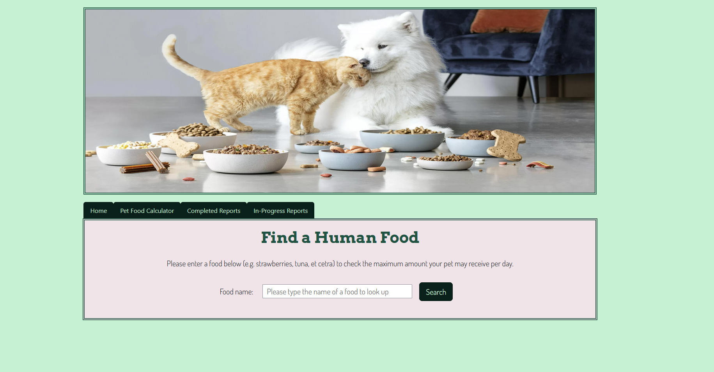
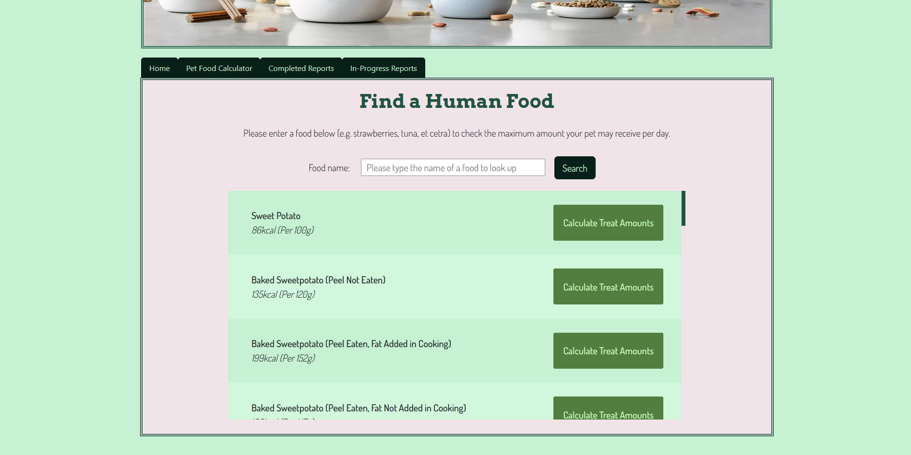
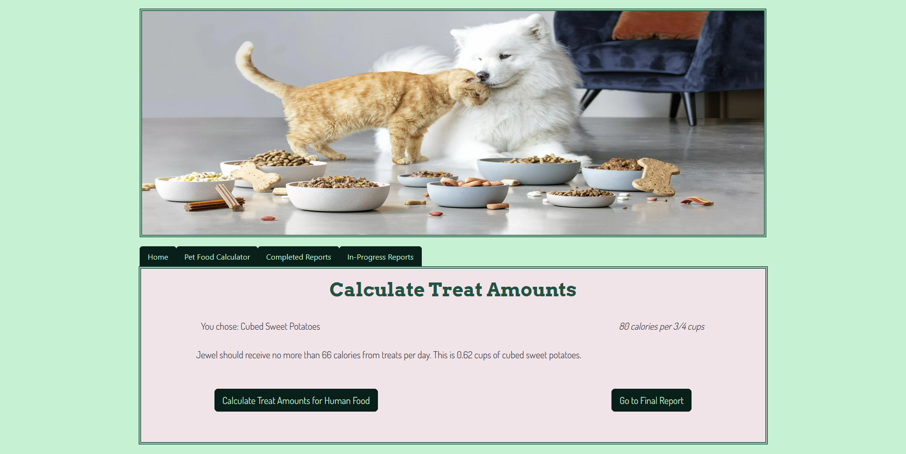

# PET FOOD CALCULATOR

#### Video Demo: <[Pet Food Calculator](https://youtu.be/GNHv3KKURjY)>

#### Description:

Welcome to the Pet Food Calculator! This is a Flask web application that allows you to input your pet's information and get recommended feeding amounts. It will also provide specific recommendations based on your pet's life stage!

When changing your pet from one food to another, it is important to do a slow transition over 5-14 days (the actual time depends on how sensitive your pet's stomach is, though generally, the transition period is 5-7 days).

### File Description:

#### main.py

Contains all of the routes and Python code for the website. Imports:

- werkzeug.security for password hashing/hash generating
- CS50's SQL for working with databases
- Flask's functions (Flask, render_template, redirect, url_for, request, flash)
  - Flash for error messages, which are passed to the applicable HTML pages below.
- os for retrieving environmental variables
- forms from forms.py
- FindInfo class from find_info.py, which returns various information about the pet
- helpers, which imports clear variables list function and login_required decorator

Features the following routes:

- Index
  - Includes a welcome message, disclaimers, and login/registration buttons via index.html
    - If the user is logged in, these buttons change to "Recalculate for an Existing Pet" (which takes the user to Completed Reports page) and "Calculate for a New Pet" (which takes the user to page 1 of the Pet Food Calculator) 
- Login
  - Allows an existing user to log in with a Flask form (LoginForm) via login.html
  - Use SQL queries to search the "users" table in pet_food_calculator.db for existing users
  - Provides error messages via Flash when a user is not found or if the password is invalid
  - If login is successful, redirects to index
- Register
  - Allows an existing user to register with a Flask form (RegisterForm) via register.html
  - Use SQL queries to search the "users" table in pet_food_calculator.db for existing users before allowing a user to register with a username
  - Provides error messages via Flash when a username is taken or if the chosen password doesn't match the password confirmation
  - Insert the new user into the "users" table of pet_food_calculator.db
  - If registration is successful, redirects to index
- Information about a pet's basic signalment is obtained through the NewSignalment Flask Form via the following routes:
  - get-signalment
    - Loads a Flask form via get_signalment.html:
  - get-signalment-pt-2
    - Loads a Flask form via get_signalment_part_2.html:
- Information about an intact female pet's reproductive status is obtained through the ReproStatus Flask Form via the following routes:
  - repro_status
    - Loads a Flask form via get_reproductive_status.html:
      - Loads in pregnancy status question
  - gestation_duration
    - Loads a Flask form via gestation_duration.html:
      - If the pet is canine and pregnant, ask how long the pet has been pregnant for
  - lactation_status
    - Loads a Flask form via get_lactation_status.html:
      - Ask the user if the pet is currently nursing
  - lactation_duration
    - Loads a Flask form via lactation_duration.html:
      - If the pet is feline and nursing, ask how long the pet has been lactating for
  - litter_size
    - Loads a Flask form via get_litter_size.html:
      - If the pet is nursing, ask how big the litter is
- get-weight
  - Loads in a Flask Form (GetWeight) that asks for the pet's weight and body condition score via get_weight_and_bcs.html
- activity
  - Loads in a Flask Form (WorkForm) that asks for a dog's activity level, categorized by light and heavy types via get_work_level.html
- confirm_data
  - Gives the user a chance to modify the pet's data before proceeding to the food calculator
- current_food
  - Loads in a Flask Form (FoodForm) via current_food.html
    - Asks for the current caloric density of the food, what form the food is (canned, dry, or pouches), and how many meals per day the pet should receive
- rer
  - Uses information obtained above to calculate the pet's resting energy rate
- der 
  - Uses information obtained above to calculate the pet's daily energy rate
- completed_report
  - Calls all database information to generate a final report with the recommended feeding amounts and other information.
  
#### forms.py

Contains all the Flask WTF Form Classes for:

- NewSignalment asks for the pet's signalment (Name, age, sex, reproductive status, species, breed)
- GetWeight asks for the pet's body condition score, pet weight, and the unit of the weight (in pounds or kilograms)
- ReproStatus asks for pregnancy, nursing, and litter size information based on what the user inputs for their pet information
  - Pregnancy questions only show up if the pet is an intact female
  - If the pet is pregnant and canine, ask how many weeks along she is
  - If the pet is not pregnant and is an intact female, ask if she is nursing a litter
  - If the pet is nursing a litter, ask for the litter size
  - If the pet is nursing and feline, ask how many weeks she has been lactating
- LoginForm asks for username and password and provides a submit button
- RegisterForm asks for a username, password, and for the user to confirm a password. Also provides a submit button
- WorkForm asks for the pet's activity level per day in both minutes and hours
- FoodForm asks for the current diet's caloric density, what form the current diet is (dry, canned, or pouches) and how many meals per day the pet currently gets

#### calculate_food.py

Contains the class CalculateFood, which contains functions that calculate RER and DER and convert decimal amounts to volumetric for easier reading

#### find_info.py

Contains the class FindInfo, which contains functions that find and return various tables from pet_food_calculator.db, including:

- DER low end, DER high end, and the mid-range of DER modifier
  - Queries either canine_der_factors or feline_der_factors based on species and life stage then returns the range start, range end, or returns the average as the mid-range
- A dictionary of all of the pet's data
- Finding pet's ID
- Finding an existing pet
- Finding all of a user's pets that don't have a completed report flag
- Finding all of the pets under a user
- Finding a pet's species
- Finding a pet's breed ID
- Checking if a pet is pregnant, nursing, pediatric, or at risk for obesity
- Finds a pet's sex
- Returns a pet's current litter size if they are nursing
- Finds an SVG for a pet based on the species and breed ID
- Finds the pet's current food form

#### helpers.py

Contains functions for login_required (which wraps applicable routes and requires a user to log in) and clear variable list (which clears all session variables) except for user ID

#### HTML forms

##### base.html

This file is a static HTML file that loads common items across all pages. These items include:

- Bootstrap CSS
- Stylesheet
- Google fonts
- Favicon
- Header image
- Navigation bar (Bootstrap)

##### index.html

This file is a static HTML file that features:

- Flashed error messages that show if applicable
- A welcome title that has the user's username if they are logged in
- Includes the project description, including a link to the American Animal Hospital Association's page and a disclaimer to consult a veterinarian or a board-certified veterinary nutritionist before making any decisions.

##### login.html

This file is a static HTML file that features:

- Flask WTF form loaded in via render_form to ask for an existing user's name and password to log in
- Flashed error messages that show if applicable

##### register.html

This file is a static HTML file that features:

- Flask WTF form loaded in via render_form to ask for a new user's name, password, and password confirmation
- Flashed error messages that show if applicable

##### get_signalment.html

This file is a static HTML file that features:

- A progress bar indicating step 1/5 (5%)
- Flashed error messages that show if applicable
- Flask WTF form for asking for user input about pet signalment (name, species)
- It was chosen to break the form down into multiple parts instead of using JavaScript to a) be more accessible and b) to prevent the page from breaking if JavaScript was disabled.
- A button that moves the form to get_signalment_part_2

##### get_signalment_part_2.html

This file is a static HTML file that features:

- A progress bar indicating step 1/9 (5%)
- Flashed error messages that show if applicable
- Flask WTF form for asking for user input about pet signalment (breed, sex, age in years, age in months)
  - The dropdown option for breed is populated by calling the cat_breeds or dog_breeds table depending on the pet's species
- Buttons that return the user to get_signalment and either get_work_level for pets who aren't intact females or to repro_status if the pet is an intact female

##### get_reproductive_status.html

This file is a static HTML file that only shows if the pet is an intact female. The file features:

- A progress bar indicating step 2/9 (11%)
- Flashed error messages that show if applicable
- Flask WTF form for asking if the pet is currently pregnant
- Buttons that return the user to pet_info or move the form forward to one of the following routes based on several conditions:
  - gestation_duration (if the pet is a pregnant dog)
  - pet_condition (if the pet is a pregnant cat)
  - lactation_status (if the pet is not currently pregnant)

##### gestation_duration.html

This file is a static HTML file that only shows if the pet is a pregnant dog. The file features:

- A progress bar indicating step 2.5/9 (16%)
- Flashed error messages that show if applicable
- Flask WTF form for asking how long the dog has been pregnant
- Buttons that return the user to repro_status or move the form forward to get_weight_and_bcs

##### get_lactation_status.html

This file is a static HTML file that only shows if the pet is an intact female. The file features:

- A progress bar indicating step 2.75/9 (21.5%)
- Flashed error messages that show if applicable
- Flask WTF form for asking if the pet is currently nursing a litter
- Buttons that return the user to repro_status or move the form forward to one of the following routes based on different  conditions:
  - litter_size (if the pet is nursing)
  - pet_condition (if the pet is not nursing)

##### get_litter_size.html

This file is a static HTML file that only shows if the pet is a nursing female. The file features:

- A progress bar indicating step 2.85/9 (27%)
- Flashed error messages that show if applicable
- Flask WTF input form that asks for the litter size
- Buttons that return the user to repro_status or move the form forward to one of the following routes based on different  conditions:
  - lactation_duration (if the pet is a nursing feline)
  - pet_condition (if the pet is a nursing canine)

##### get_weight_and_bcs.html

This file is a static HTML file that features:

- A progress bar indicating step 3/9 (33%)
- Flashed error messages that show if applicable
- Information about body condition scores and their importance
- Accordion dropdown from Bootstrap that shows canine or feline body condition scores depending on species
- Flask WTF form for asking for user input about pet weight and body condition score
- Buttons that return the user to repro_status or move the form forward to one of the following routes based on different  conditions:
  - confirm_data (if the pet is a feline)
  - get_work_level (if the pet is a canine)

##### get_work_level.html

This file is a static HTML file that only shows if the pet is a dog. The file features:

- A progress bar indicating step 4/9 (44%)
- Flask WTF form for asking for user input about how much activity their pet gets per day
  - Asks user to break down activity into "light" and "heavy" work hours and minutes
  - Gives examples of what kinds of activities count as light or heavy
- Buttons that return the user to get_weight_and_bcs or  confirm_pet_info

##### confirm_pet_info.html

This file is a static HTML file that features:

- A progress bar indicating step 5/9 (55%)
- Includes a table with the pet's signalment and reproductive information input up to this point in the form
  - Some cells only show based on whether the information exists for that column in that row
- Buttons that move the user forward to current_food or move the form backward to one of the following routes based on different conditions:
  - returns to pet_condition (if the pet is a feline)
  - returns to get_work_level (if the pet is a canine)

##### current_food.html

This file is a static HTML file that features:

- A progress bar indicating step 6/9 (66%)
- Flask WTF form for asking user for information about their pet's food (calorie information and food form) and how many meals the pet gets per day
- Buttons that return the user to confirm_pet_info or move the form forward to rer

##### rer.html

This file is a static HTML file that features:

- A progress bar indicating step 7/9 (77%)
- Includes information about what Resting Energy Rate is and what formula was used to calculate it
- Calculates the Resting Energy Rate based on the pet's weight
- Provides the disclaimer that this formula may work well for most pets, but that individual pets may need more or less food
- Buttons that return the user to confirm_pet_info or move the form forward to der

##### der.html

This file is a static HTML file that features:

- A progress bar indicating step 8/9 (88%)
- Includes information about what Daily Energy Rate is and what formula was used to calculate it
- Calculates the Daily Energy Rate based on the pet's weight, RER, and life stage
- Buttons that return the user to rer or move the form forward to completed_report

##### complete_report.html

This file is a static HTML file that features:

- Flashed error messages if applicable
- Provides the pet's name and an SVG that matches the breed of the pet
  - SVGs credit to [WallArtBox on Etsy](https://www.etsy.com/shop/wallartbox)
- Returns the pet's signalment and reproductive status to the user
- Provides the DER formula that was used to calculate calorie amounts
- Provides daily and per-meal feeding amounts and water recommendations
- Recommendations are tailored based if a pet is canine or feline, pregnant, nursing, pediatric, obese, obese prone, or ideal weight
- Provide puzzle toy recommendations with pictures plus a link to a chewy search for more puzzle toys based on species
- Provide treat amount recommendations (Recommendations are between 8-10% of RER)
- A button that returns the user to der page

##### finished_reports.html

This file is a static HTML file that features:

- A table that dynamically expands based on how many columns are returned when the database is queried for pets under the user
- For each pet a user has with a finished report stamp in the database, the following information is shown:
  - Dogs have a dog pawprint SVG on either side of their name, cats have a cat pawprint SVG on either side of their name
    - SVGs credit to [RostoumArt on Etsy](https://www.etsy.com/shop/RostoumArt)
  - Each pet's signalment is under their name
  - A pet food bowl SVG
    - Dogs have a bone on the bowl, cats have a pawprint
    - SVGs credit again to [RostoumArt on Etsy](https://www.etsy.com/shop/RostoumArt)
  - Buttons to take the user to the pet's final report or to modify the pet's information via edit_info

##### edit_report.html

This file is a static HTML file that features:

- Includes a table with the pet's signalment and reproductive information
  - Some cells only show based on whether the information exists for that column in that row
  - Each cell includes a button that takes the user back to the route where they can enter updated data to edit the row
- A pet food bowl SVG surrounding a header for feeding information
  - Dogs have a bone on the bowl, cats have a pawprint
  - SVGs credit again to [RostoumArt on Etsy](https://www.etsy.com/shop/RostoumArt)
- Includes a table with feeding information (RER, DER, DER modifier, current caloric density and food form, recommended daily and per-meal feeding amounts)
- Includes a button that takes the user back to the spot in the form most likely to be applicable for the pet
  - i.e. if the pet was pediatric at the time of the first report, take them to the part of the form where they must input a new age, etc.

##### wip_reports.html

This file is a static HTML file that features:

- Includes a table with the pet's available signalment and reproductive information
  - Some cells only show based on whether the information exists for that column in that row
  - Buttons that take the user back to the route where they can enter updated data to edit the row

#### Images

- Canine and feline BCS image credit to [McLean Animal Hospital](https://www.mcleanvet.com/know-pet-good-weight/)
- Canine and feline puzzle toy images credited to their respective Chewy.com pages
  - [Canine](https://www.chewy.com/brightkins-dj-doggo-puzzle-feeder-dog/dp/930046)
  - [Feline](https://www.chewy.com/doc-phoebes-cat-co-indoor-hunting-cat/dp/179101)

#### SVGs

- All cat and dog SVGs credited to [WallArtBox on Etsy](https://www.etsy.com/shop/wallartbox)
- Dog paw, cat paw, food bowl, and pet food bag SVGs credited to [RostoumArt on Etsy](https://www.etsy.com/shop/RostoumArt)

#### Database

The database, pet_food_calculator.db, contains several tables:

- "pets", which contains information about the user's pets
  - Contains the following columns:
  - "pet_id", the primary key, a unique integer that autoincrements
  - "owner_id", an integer that references the primary key "id" in the "users" table
  - "name", a string that can't be NULL that references the pet's name
  - "age_in_years", an integer
  - "age_in_months", an integer
  - "species", a string that can't be NULL
  - "breed"
  - "canine_breed_id", an integer that references the primary key "BreedID" in the "dog_breeds" table
  - "feline_breed_id", an integer that references the primary key "BreedID" in the "cat_breeds" table
  - "sex", a string
  - "bcs", an integer that represents the pet's body condition score
  - "weight", a float
  - "units", a string that represents whether the weight is in pounds or kilograms
  - "converted_weight", a float
  - "converted_weight_units", a string
  - "body_fat_percentage", a string
  - "ideal_weight_lbs", a float that represents the pet's ideal weight in pounds
  - "ideal_weight_kgs", a float that represents the pet's ideal weight in kilograms
  - "is_pediatric", a string that is either "y" or "n"
  - "is_pregnant", a string that is either "y" or "n"
  - "weeks_gestating", an integer that represents how many weeks the pet has been pregnant (if they are a dog)
  - "is_nursing", a string that is either "y" or "n"
  - "litter_size", an integer
  - "weeks_nursing", an integer
  - "activity_level", a string that contains either "Sedentary", "Low", "Heavy", or "Moderate"
  - "rer", a float that represents the pet's resting energy rate
  - "canine_der_factor_id", an integer that references the primary key "factor_id" in the "canine_der_factor_id" table
  - "feline_der_factor_id", an integer that references the primary key "factor_id" in the "feline_der_factor_id" table
  - "der", a float that represents the pet's daily energy rate
  - "der_modifier", a float that represents the pet's DER modifier
  - "meals_per_day", a float
  - "current_food_kcal", a float that represents how many kcal are in a pet's current food per volume (i.e. per cup/can/pouch)
  - "current_food_form", a string that contains "dry", "canned", or "pouch"
  - "rec_treat_kcal_per_day", a float that represents the recommended max kcals the pet should get from treats per day
  - "current_food_amt_rec", a string that represents how much of the pet's current food they should get per day
  - "current_food_amt_per_meal", a string that represents how much of the pet's current food they should get per meal
  - "date_of_first_report", a datetime column that represents the date of the first report
  - "most_recent_report_date", a datetime column that represents the date of the most recent report
- "users", which contains information about the users
  - "id", the primary key, a unique integer that autoincrements
  - "username", a string
  - "password", a string that represents the encrypted password
  - "email", a string
- "cat_breeds", which contains information about various cat breeds
  - Columns adapted based on CSV information from [Phiggins on Github](https://github.com/phiggins/phiggins_coding_challenge/blob/master/examples/cat_breeds.csv)
  - "BreedID", the primary key, a unique integer that autoincrements
  - "Breed", a string that represents the cat's breed name
  - "Weight(pounds)", a string that represents a range of weights the breed can be
  - "AvgWeight(pounds)", a real number that represents the average weight of the breed in pounds
  - "AvgWeight(kg)", a real number that represents the average weight of the breed in kilograms
  - "SizeCategory", a string that includes "Small", "Small-Medium", "Medium", "Medium-Large", "Large"
  - "Notes", a string that clarifies when a size category tips in one direction or the other (small to medium, medium to large, etc)
  - "PediatricUntil", a string that is either "y" or "n"
  - "ObeseProneBreed", a string that is either "y" or "n"
  - "svg", a string that contains the file path for the cat or dog breed SVG
- "dog_breeds", which contains information about various dog breeds
  - Columns adapted based on CSV information from [MeganSorenson on Github](https://github.com/MeganSorenson/American-Kennel-Club-Breeds-by-Size-Dataset/blob/main/AmericanKennelClubBreedsBySize.xlsx)
  - "BreedID", the primary key, a unique integer that autoincrements
  - "Breed", a string that represents the dog's breed name
  - "Weight(pounds)", a string that represents a range of weights the breed can be
  - "AvgWeight(pounds)", a real number that represents the average weight of the breed in pounds
  - "AvgWeight(kg)", a real number that represents the average weight of the breed in kilograms"
  - "SizeCategory", a string that includes "X-Small", "Small", "Medium", "Large", "X-Large"
  - "ObeseProneBreed", a string that is either "y" or "n"
  - "svg", a string that contains the file path for the cat or dog breed SVG
  - "mime_type", a string that describes SVG as an svg
- "canine_der_factors", which contains information about DER factors for dogs
  - Created based on information found on [Today's Veterinary Nurse](https://todaysveterinarynurse.com/veterinary-energy-calculations-and-proper-caloric-intake/)
  - "factor_id", the primary key, a unique integer that autoincrements
  - "life_stage", a string that contains the dog's life stage
  - "canine_der_factor_range_start", a float that represents the start of the range of the DER modifier per life stage
  - "canine_der_factor_range_end", a float that represents the end of the range of the DER modifier per life stage
  - "notes", a string that contains information that helps clarify row information
- "feline_der_factors", which contains information about DER factors for dogs
  - Created based on information found on [Today's Veterinary Nurse](https://todaysveterinarynurse.com/veterinary-energy-calculations-and-proper-caloric-intake/)
  - "factor_id", the primary key, a unique integer that autoincrements
  - "life_stage", a string that contains the cat's life stage
  - "feline_der_factor_range_start", a float that represents the start of the range of the DER modifier per life stage
  - "feline_der_factor_range_end", a float that represents the end of the range of the DER modifier per life stage
  - "notes", a string that contains information that helps clarify row information

## Version 2 (completed 9/3/24)

### Treat Calculator

The portfolio project for day 96 of [100 Days of Code: The Complete Python Pro Bootcamp](https://www.udemy.com/course/100-days-of-code). The goal was to create a web application based on an API we found interesting. I chose the API from [FatSecret](https://platform.fatsecret.com/) because I wanted to to see the caloric information of various human foods. Using this information, the Pet Food Calculator calculates how much of a chosen human food they can receive per day without unbalancing their diet. Treat amounts are between 8-10% of a pet's resting energy requirements.

#### Choosing a Human Food

The user can choose the food that they want to calculate for by clicking the "Calculate Treat Amounts" button.

#### Final Treat Page Result

The final treat calculation page provides a reminder of the max amount of calories a pet can have per day from treats without unbalancing their diet. If there is more than a certain amount of a type of treat, users are cautioned to ensure with their vet that there will be no expected side effects or potential health issues.

### Future version goals

This was a project I had a lot of fun with, and I could work on it forever! This is version 2 of my final project, but I have the following goals for future versions:

- Food transition calculator
  - This would help users transition their pet from their current diet to another food by providing a table in the final report
  - This would calculate volumetric feeding amounts per each day (5-7 days for pets that don't have a sensitive stomach, or 10-14 days for pets that have a sensitive stomach)
  - There would be an additional route that asks for information for up to 2 new foods if the user is interested in transitioning their pet to a new food or if they are interested in feeding more than one diet
- Refactoring for speed and to reduce redundancy
- AI body condition scorer
  - Allow the user to upload several pictures of their pet (bird's eye, from the side, from the front) to attempt to determine the pet's body condition score
  - AI would view the pet's photos and return recommended body condition scores with the option to allow the user to override the recommendations
