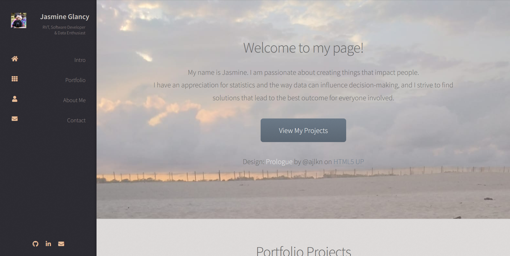

# Assignment 2: Portfolio Website

The portfolio project for day 83 of [100 Days of Code: The Complete Python Pro Bootcamp](https://www.udemy.com/course/100-days-of-code): A website to showcase portfolio projects! I used the design [Prologue by @ajlkn on HTML5 UP](https://html5up.net/prologue) and built a Flask + Python application around it.
