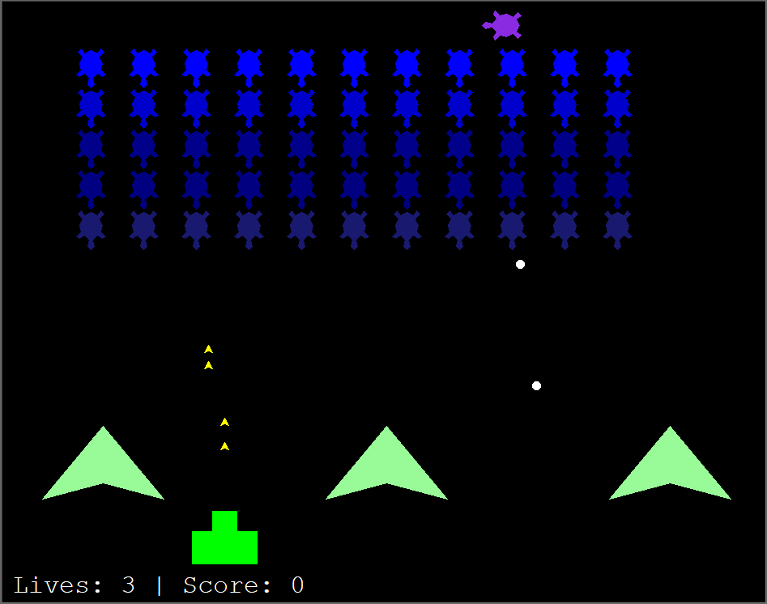
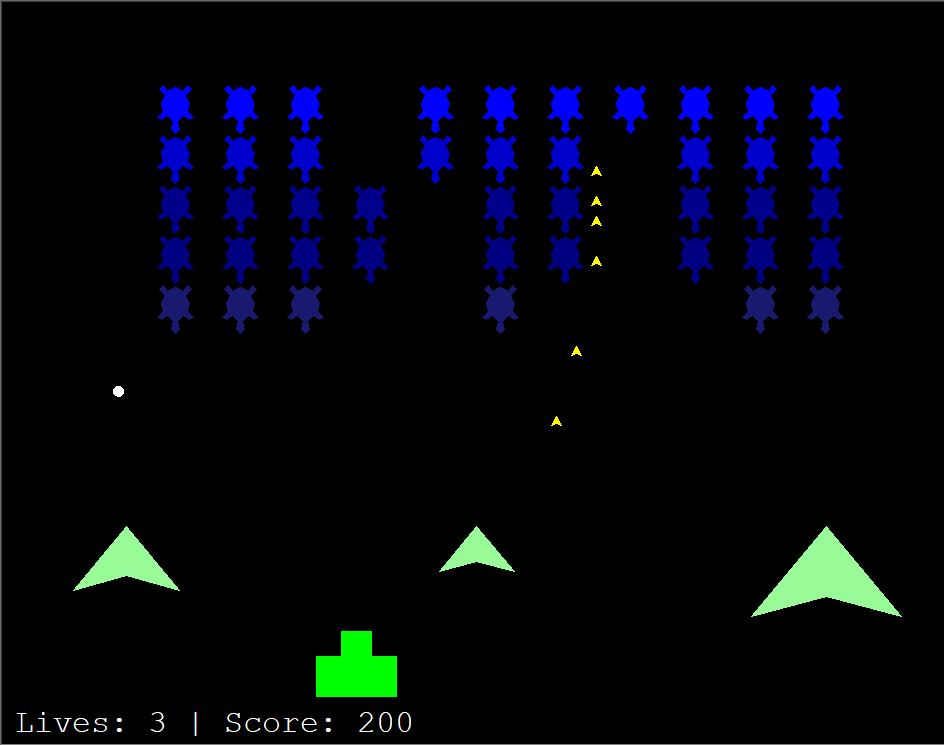
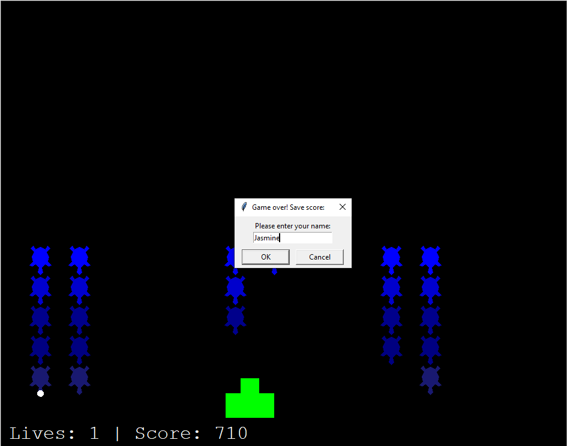
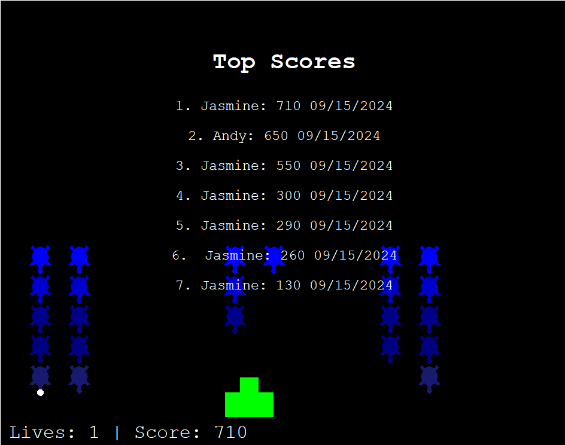

# Assignment 14: Space Invaders

The portfolio project for day 95 of [100 Days of Code: The Complete Python Pro Bootcamp](https://www.udemy.com/course/100-days-of-code). The goal was to create a version of Space Invaders using Python and Turtle.

I heavily referenced my code for [Breakout](https://github.com/jglancy95/Portfolio_Projects/tree/main/JGL%20Breakout) for this project, as there appeared to be a lot of similarities between the two games!

## Movement and Mechanics

The player can move the cannon left using the "A" key or right using the "D" key. When space bar is pressed, a "laser" is fired from the cannon. If the laser hits a bunker (represented by the upside down arrows) from the bottom or the top, the bunker reduces in size. After 3 hits, the bunkers disappear and no longer protect the player. If the player is hit, they lose a life.

Occasionally, a purple turtle will cross the screen at the top. If this turtle is hit, it will reward extra points. When all the aliens are defeated, they will be created more closely to the player.

### Saving a Score

When the game ends, a pop-up appears asking for the player's name.

### View Top Scores

After the player enters their name into the database, a list of up to 10 players is shown on the screen.

## Database

A database is used to keep track of alien colors, alien score values, and past player scores. The schema for the tables are as follows:

### high_scores.db

Contains several tables:

- alien_colors: for the text version of colors used to color the turtles.
- high_scores: keeps track of players and their high scores
- score_values: keeps track of score values by alien color

#### alien_colors table

The schema for the table is as follows:

- color_id: An integer that represents a unique primary key that autoincrements
- color: A string containing the text name of the turtle color

#### high_scores table

The schema for the table is as follows:

- player_id: An integer that represents a unique primary key that autoincrements
- player_name: A string containing the name of the player
- score: An integer representing the users score
- score_obtained_on: A Datetime column that represents the date the score was obtained

#### score_values table

The schema for the table is as follows:

- score_id: An integer that represents a unique primary key that autoincrements
- score_color: An integer that represents a foreign key that references color_id
- value: An integer representing the score value of the color
