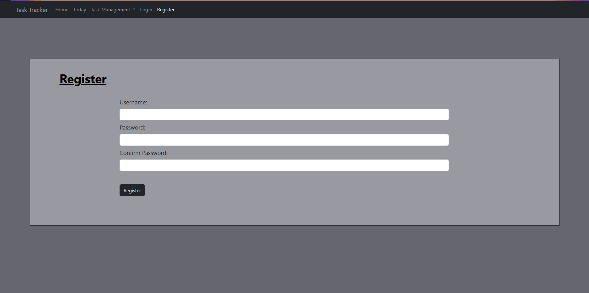
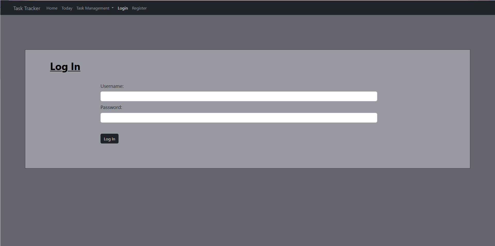

# Assignment 8: ToDo Website

The portfolio project for day 89 of [100 Days of Code: The Complete Python Pro Bootcamp](https://www.udemy.com/course/100-days-of-code). The goal was to create a website that keeps track of tasks to be completed for the month.

I used Flask, Bootstrap, HTML, CSS, and Python to create the functionality and aesthetics of the website. I used SQLAlchemy to create and query the database.

### Register Page

Users who don't have an account already may register to add and modify tasks.

### Log In Page

Users who have an account already may log in to their accounts via the "Log In" route.

## How to add a Task
