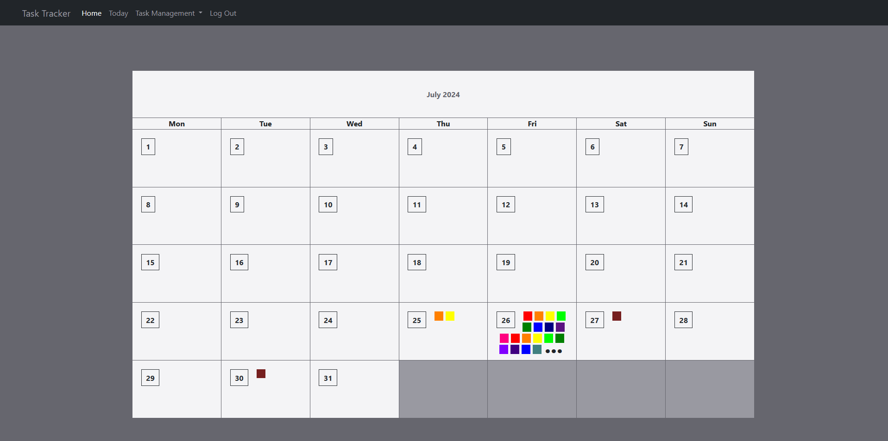
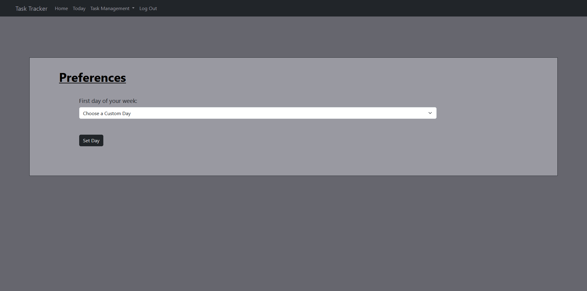
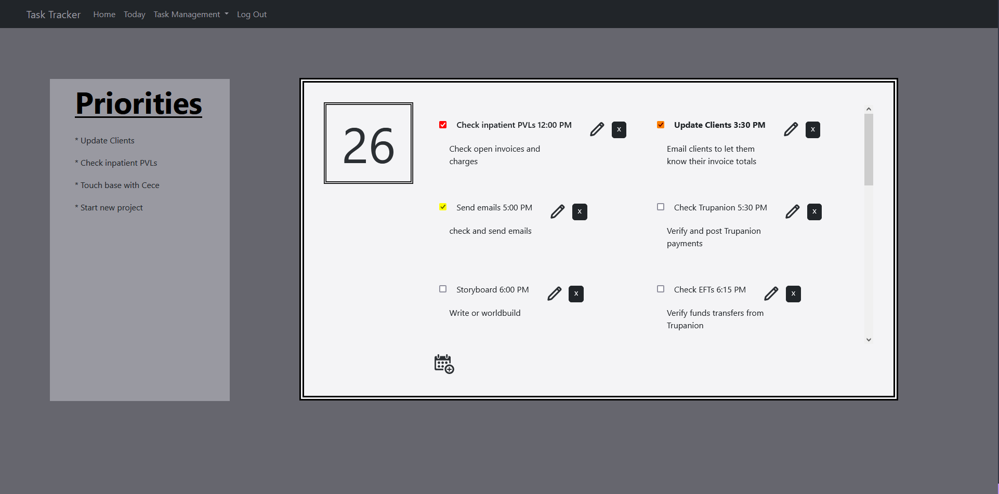
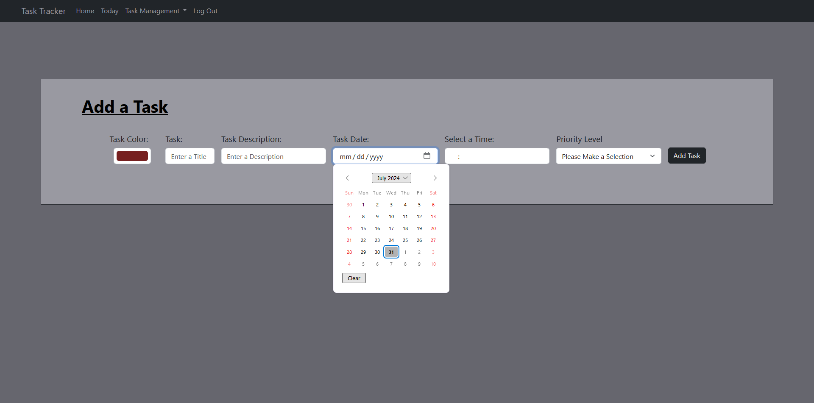
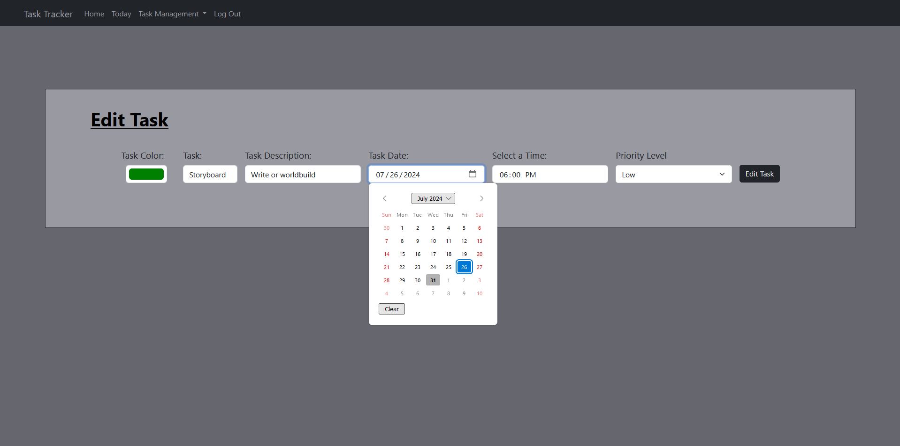

# Assignment 8: ToDo Website

The portfolio project for day 89 of [100 Days of Code: The Complete Python Pro Bootcamp](https://www.udemy.com/course/100-days-of-code). The goal was to create a website that keeps track of tasks to be completed for the month.

I used Flask, Bootstrap, HTML, CSS, and Python to create the functionality and aesthetics of the website. I used SQLAlchemy to create and query the database.

SVGs were created on [SVG Repo](https://www.svgrepo.com).

## Index page

The index page includes the calendar for the current month. Users can choose which day of the week is their starting day upon registering.

If any tasks are present, they are represented by colored boxes. If there are more tasks than would fit in the calendar day, an ellipsis is added. To add and view tasks, a user must be registered. Users may click on any day's number to be redirected to the day view for that specific date. For example, if the user clicks 26, they would be directed to July 26th, 2024 in this case.

### How to Register as a New User

Users who don't have an account already may register to add and modify tasks.

#### Choosing a Preferred First Weekday

Users who first register are prompted to choose their preferred first day of the week. If no date is chosen, the default is used.

### Logging In

Users who have an account already may log in to their accounts via the "Log In" route.

## Day View

When the user is redirected to any day in the calendar, the database is queried to bring up any tasks related to that day. The medium- and high-level priorities for the day are displayed on the left, with all tasks in the day displayed on the right in ascending order. With each task, there is a checkbox, task name, description, time (in 12-hour format), and the ability to modify or delete individual tasks. When the user clicks the checkbox, the box is colored in with the color the user chose for the task. Additional tasks can be added via the calendar SVG at the bottom of the task list.

### How to Add a Task

Users may choose a color, name, description, date, time, and priority level for each task. A date picker with an HTML5 calendar was found as a suggestion on Stack Overflow, courtesy of [Carol Skelly](www.codeply.com/p/zU0EWDmIfn). Time input functionality and processing were created with help from [w3 Schools](https://www.w3schools.com/tags/att_input_type_time.asp).

### How to Modify a Task

Users can modify tasks by clicking the pencil SVG by a task. They will be redirected to the edit page with the task's current information automatically loaded into the form.

### How to Delete a Task

Tasks may be deleted by pressing the "x" button for each task.
