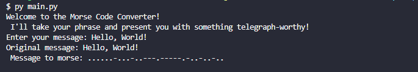

# Assignment 1: Text to Morse Code Converter

The portfolio project for day 82 of [100 Days of Code: The Complete Python Pro Bootcamp](https://www.udemy.com/course/100-days-of-code): A Morse code converter that converts text to its corresponding string of dots and dashes. This is a text-based program written in Python.

Created with the help of [Geeks for Geeks](https://www.geeksforgeeks.org/morse-code-translator-python/)
